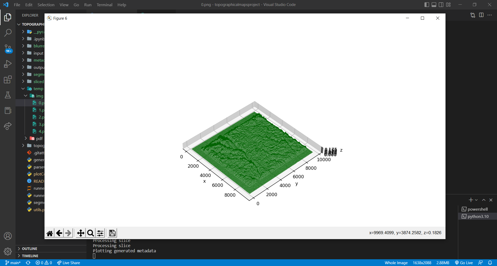

# TopographicalMapsProject

A program which parses through a CSV database of topographical maps of various locations around the USA and plots the terrain onto a 3D plane

Uses:
- Matplotlib
- OpenCV
- Numpy

First run "python3 -m utils init" and then "python3 -m utils clean" at the root of the project to purge any unnecessary files

Add the PDF files from the archive you want to view as 3D models

Then run "python3 -m runner.py" in order to run the project

